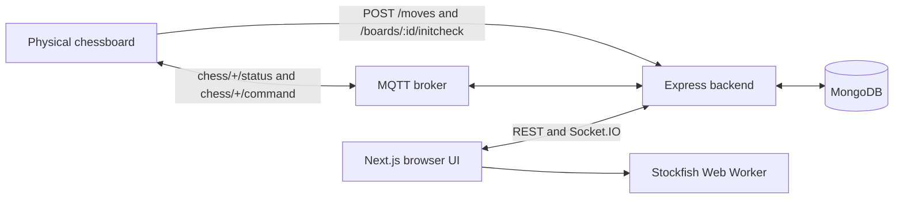

# TTLab Chess Web

TTLab Chess Web connects a physical electronic chessboard to a real-time web interface. The repository contains an Express/Socket.IO/MQTT backend and a Next.js frontend, with MongoDB providing durable active-game and history snapshots.

Current release: `v1.1.4-change5`.

## Runtime architecture



- The physical board submits moves over HTTP and publishes connectivity/lifecycle messages over MQTT.
- Express owns game mutations, authentication, persistence, concurrency checks, and Socket.IO broadcasts.
- Next.js renders the home, board, history, dashboard, guide, login, and paste/import pages.
- Stockfish runs in the browser for optional live evaluation and saved post-game analysis.

The detailed design is in [docs/01-architecture.md](docs/01-architecture.md), and the complete documentation index is [docs/README.md](docs/README.md).

## Requirements

- Node.js 20 or newer
- npm
- MongoDB
- An MQTT broker
- Docker with Compose for container deployment

## Environment

Copy [.env.example](.env.example) to `.env` and replace every placeholder. Real `.env` files are ignored by Git.

Required backend values:

```env
MONGO_URI=<mongodb-connection-string>
JWT_SECRET=<private-random-secret-at-least-32-characters>
URL_HIVEMQTT=<mqtt-or-mqtts-broker-url>
MQTT_PORT=8883
```

Common deployment and optional bootstrap values:

```env
PORT=8080
CORS_ORIGINS=http://localhost:3000
FRONTEND_BASE_PATH=
BACKEND_PUBLIC_URL=http://localhost:8080

ADMIN_USERNAME=<private-admin-name>
ADMIN_EMAIL=<private-admin-email>
ADMIN_PASSWORD=<private-high-entropy-password>

USER_USERNAME=<standard-user-name>
USER_EMAIL=<standard-user-email>
USER_PASSWORD=<standard-user-password>
```

Bootstrap accounts are synchronized when the backend starts. Passwords are hashed with bcrypt before MongoDB storage. Keep real administrator credentials only in local or deployment secrets.

See [docs/04-environment.md](docs/04-environment.md) for every supported variable.

## Local development

Install dependencies:

```powershell
npm install
npm --prefix frontend install
```

Start the backend with automatic reload:

```powershell
npm run dev
```

Start the frontend in a second terminal:

```powershell
npm --prefix frontend run dev
```

The backend port comes from `.env`. The sample uses `8080`; the frontend development server normally uses `3000`. The Windows launcher only stops an existing Node.js process on the configured backend port and refuses to terminate unrelated processes.

Production checks:

```powershell
npm run build
npm --prefix frontend run build
```

## Docker Compose

The Compose stack contains:

- `ttlab-chess-app`: backend, published on `${PORT:-80}`
- `frontend`: Next.js standalone server, published on host port `4000`

Build and start:

```bash
docker compose build --no-cache
docker compose up -d
docker compose ps
```

Useful checks:

```bash
docker compose logs --tail=150 -f ttlab-chess-app
docker compose logs --tail=150 -f frontend
curl http://127.0.0.1:${PORT:-80}/health
curl http://127.0.0.1:4000/
```

For a VPS deployment under `/chess`, Nginx proxies `/chess` to port `4000`, backend REST paths to the backend port, and `/socket.io/` to the backend with upgrade headers. See [docs/16-deployment.md](docs/16-deployment.md).

## Authentication and authorization

- Registration creates a `user` account.
- `ADMIN_*` can bootstrap a private developer administrator.
- `USER_*` can bootstrap a standard account.
- Administrator REST mutations require `Authorization: Bearer <JWT>`.
- Standard users cannot delete, restore, permanently delete, or view trashed history records.
- Hiding controls in the frontend is only presentation; the backend independently checks the JWT role.

## MQTT contract

Connectivity topic:

```text
chess/<boardID>/status
```

Supported status values are `online` and `offline`.

Lifecycle topic:

```text
chess/<boardID>/command
```

Supported payloads:

```json
{"command":"restart_game_esp"}
{"command":"restart_game"}
{"command":"resign","side":"white","requestId":"unique-device-command-id"}
{"command":"resign","side":"black","requestId":"unique-device-command-id"}
{"command":"draw","requestId":"unique-device-command-id"}
```

Both restart commands perform the same in-place reset and retain `gameID`, names, and clock configuration. Resign/draw finalizes history, emits the result to the old game room, and creates the next waiting game for that physical board.

## REST surface

The backend mounts:

- `/auth`
- `/boards`
- `/moves`
- `/games`
- `/socket.io/`
- `/health`

There is no `/api` prefix. See [docs/06-api-rest.md](docs/06-api-rest.md) and [docs/07-api-socket.md](docs/07-api-socket.md).

## Repository map

```text
BEChessWeb/
├── frontend/          Next.js application, themes, locales, Stockfish and static assets
├── backend/src/       Express backend, MongoDB models, services, sockets and MQTT
├── docs/              Maintained architecture and operating documentation
├── tools/             Local development and MQTT helper scripts
├── Dockerfile         Backend image
├── docker-compose.yml Backend and frontend services
└── package.json       Backend scripts and release version
```

## Release policy

The root package, frontend package, and `frontend/lib/app-version.ts` use the same value. Changes are tagged as `v<base>-changeN`; the thirtieth accepted change publishes the next base version and resets the suffix. See [docs/24-versioning.md](docs/24-versioning.md).
