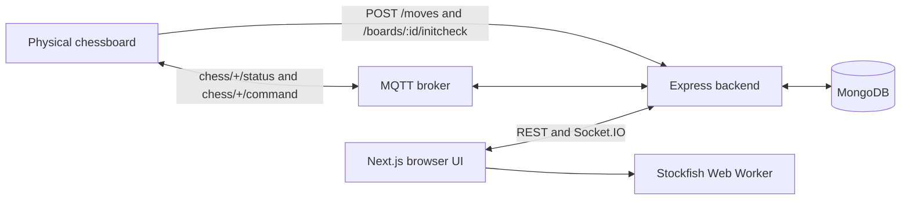

# TTLab Chess Web

TTLab Chess Web connects a physical electronic chessboard to a real-time web interface. The repository contains an Express/Socket.IO/MQTT backend and a Next.js frontend, with MongoDB providing durable active-game and history snapshots.

Current release: `v1.1.5-change1`.

## Table of contents

- [Features](#features)
- [Architecture](#runtime-architecture)
- [Requirements](#requirements)
- [Quick start](#quick-start)
- [Configuration](#environment)
- [Docker deployment](#docker-compose)
- [Authentication](#authentication-and-authorization)
- [Documentation](#documentation)
- [Validation](#validation)
- [Contributing](#contributing)
- [Security](#security)

## Features

- Real-time physical-board moves through HTTP, MQTT, and Socket.IO.
- Durable active-game and history snapshots in MongoDB.
- Administrator-only game lifecycle controls and FEN correction workflows.
- Branch-aware FEN recovery with raw and edited histories preserved separately.
- Browser-side Stockfish evaluation and saved post-game analysis.
- Configurable spectator delay with manual seconds and quick presets.
- Vietnamese and English localization with light and dark themes.

## Runtime architecture



- The physical board submits moves over HTTP and publishes connectivity/lifecycle messages over MQTT.
- Express owns game mutations, authentication, persistence, concurrency checks, and Socket.IO broadcasts.
- Next.js renders the home, board, history, dashboard, guide, login, and paste/import pages.
- Stockfish runs in the browser for optional live evaluation and saved post-game analysis.

Spectator delay is configured by an administrator through `/broadcast-settings`.
The value is stored in MongoDB in milliseconds; administrator sockets receive
authoritative updates immediately while public snapshots are released after the
configured delay. A zero-second delay keeps public updates immediate.

The detailed design is in [docs/01-architecture.md](docs/01-architecture.md), and the complete documentation index is [docs/README.md](docs/README.md).

## Requirements

- Node.js 20 or newer
- npm
- MongoDB
- An MQTT broker
- Docker with Compose for container deployment

## Environment

Copy [.env.example](.env.example) to `.env` and replace every placeholder. Real `.env` files are ignored by Git.

Required backend values:

```env
MONGO_URI=<mongodb-connection-string>
JWT_SECRET=<private-random-secret-at-least-32-characters>
URL_HIVEMQTT=<mqtt-or-mqtts-broker-url>
MQTT_PORT=8883
```

Common deployment and optional bootstrap values:

```env
PORT=8080
CORS_ORIGINS=http://localhost:3000
FRONTEND_BASE_PATH=
BACKEND_PUBLIC_URL=http://localhost:8080

ADMIN_USERNAME=<private-admin-name>
ADMIN_EMAIL=<private-admin-email>
ADMIN_PASSWORD=<private-high-entropy-password>

USER_USERNAME=<standard-user-name>
USER_EMAIL=<standard-user-email>
USER_PASSWORD=<standard-user-password>
```

Bootstrap accounts are synchronized when the backend starts. Passwords are hashed with bcrypt before MongoDB storage. Keep real administrator credentials only in local or deployment secrets.

See [docs/04-environment.md](docs/04-environment.md) for every supported variable.

## Quick start

Install dependencies:

```powershell
npm install
npm --prefix frontend install
```

Start the backend with automatic reload:

```powershell
npm run dev
```

Start the frontend in a second terminal:

```powershell
npm --prefix frontend run dev
```

The backend port comes from `.env`. The sample uses `8080`; the frontend development server normally uses `3000`. The Windows launcher only stops an existing Node.js process on the configured backend port and refuses to terminate unrelated processes.

Production checks:

```powershell
npm run build
npm --prefix frontend run build
```

## Docker Compose

The Compose stack contains:

- `ttlab-chess-app`: Express/Socket.IO backend, published on `${PORT}`
- `recover-service`: internal Python FEN recovery service on Compose port `8000`
- `frontend`: Next.js standalone server, published on host port `4000`

Build and start:

```bash
docker compose build --no-cache
docker compose up -d
docker compose ps
```

Useful checks:

```bash
docker compose logs --tail=150 -f ttlab-chess-app
docker compose logs --tail=150 -f frontend
curl http://127.0.0.1:${PORT:-80}/health
curl http://127.0.0.1:4000/
```

For a VPS deployment under `/chess`, Nginx proxies `/chess` to port `4000`, backend REST paths to the backend port, and `/socket.io/` to the backend with upgrade headers. See [docs/16-deployment.md](docs/16-deployment.md).

## Authentication and authorization

- Registration creates a `user` account.
- `ADMIN_*` can bootstrap a private developer administrator.
- `USER_*` can bootstrap a standard account.
- Administrator REST mutations require `Authorization: Bearer <JWT>`.
- Standard users cannot delete, restore, permanently delete, add/edit/delete individual FEN snapshots, or view trashed history records.
- Hiding controls in the frontend is only presentation; the backend independently checks the JWT role.

### Administrator FEN review corrections

On a finished game, an administrator can open Move Review and use the `+`
button beside a base FEN row to insert a duplicate immediately below it. The
duplicate is edited directly on the normal chessboard: drag an existing piece,
drag a spare black/white piece onto a square, click a spare piece and then a
square, or right-click a square to remove a piece. Saving writes the corrected
sequence to `fenHistoryEdited`; raw `fenHistory` received from the physical
board is preserved. The vertical evaluation bar is rendered in the same row
and height as the board. On narrow review layouts, evaluation, move-suggestion,
and move-annotation actions are grouped in the menu button.

## MQTT contract

Connectivity topic:

```text
chess/<boardID>/status
```

Supported status values are `online` and `offline`.

Lifecycle topic:

```text
chess/<boardID>/command
```

Supported payloads:

```json
{"command":"restart_game"}
{"command":"resign","requestId":"unique-device-command-id"}
{"command":"resign","side":"white","requestId":"unique-device-command-id"}
{"command":"resign","side":"black","requestId":"unique-device-command-id"}
{"command":"draw","requestId":"unique-device-command-id"}
```

`restart_game` resets the current game in place and retains its `gameID`, names, and clock configuration. A `resign` command without `side` is the physical-board long-press flow: the backend evaluates the final position when possible, otherwise records an unconfirmed result; it then archives the game, creates the next waiting game, and sends `restart_game` back to the board. A `resign` command with `side`, and `draw`, finalize the selected result and create the next waiting game.

## REST surface

The backend mounts:

- `/auth`
- `/boards`
- `/broadcast-settings` (administrator-only delay configuration)
- `/moves`
- `/games`
- `/socket.io/`
- `/health`

There is no `/api` prefix. See [docs/06-api-rest.md](docs/06-api-rest.md) and [docs/07-api-socket.md](docs/07-api-socket.md).

## Repository map

```text
BEChessWeb/
├── frontend/          Next.js application, themes, locales, Stockfish and static assets
├── backend/src/       Express backend, MongoDB models, services, sockets and MQTT
├── docs/              Maintained architecture and operating documentation
├── tools/             Local development and MQTT helper scripts
├── Dockerfile         Backend image
├── docker-compose.yml Backend and frontend services
└── package.json       Backend scripts and release version
```

## Release policy

The root package, frontend package, and `frontend/lib/app-version.ts` use the same value. Changes are tagged as `v<base>-changeN`; the thirtieth accepted change publishes the next base version and resets the suffix. See [docs/24-versioning.md](docs/24-versioning.md).

## Deployment runbook

The recommended VPS deployment uses Docker Compose. MongoDB and MQTT remain external services; Compose starts the backend, internal FEN recovery service, and frontend.

### Prepare and configure

Clone the repository, or pull the latest commit in an existing checkout. The VPS does not need global Node.js when deploying with Docker.

```bash
git clone https://github.com/phong571737/BEChessWeb.git
cd BEChessWeb
cp .env.example .env
nano .env
```

For `/chess`, set these values in the private root `.env` file:

```env
FRONTEND_BASE_PATH=/chess
BACKEND_PUBLIC_URL=http://<public-domain>
BACKEND_INTERNAL_URL=http://ttlab-chess-app:8080
RECOVER_SERVICE_URL=http://recover-service:8000
RECOVERY_TIMEOUT_MS=60000
```

Also set real `MONGO_URI`, `JWT_SECRET`, `URL_HIVEMQTT`, `MQTT_PORT`, `MQTT_USER`, `MQTT_PASSWORD`, and `CORS_ORIGINS`. `BACKEND_PUBLIC_URL` is the public origin only; do not append `/chess`. Keep `.env` private and do not put secrets in `.env.example` or `docker-compose.yml`.

### Validate, build, and start

Run `docker compose config` first; it must not warn that `BACKEND_INTERNAL_URL` or `RECOVER_SERVICE_URL` is empty. Then run `docker compose build --no-cache`, `docker compose up -d --remove-orphans`, and `docker compose ps`.

The services are: `ttlab-chess-app` backend on `${PORT}`; `chess-recover-service` on internal port `8000`; and `chess-frontend` on host port `4000` forwarding to container port `3000`. Recovery is intentionally not exposed to the internet; the backend reaches it as `http://recover-service:8000`.

### Verify and configure Nginx

Check `curl -i http://127.0.0.1:${PORT}/health`, `curl -i http://127.0.0.1:4000/chess`, and the logs with `docker compose logs --tail=150 ttlab-chess-app`, `docker compose logs --tail=150 recover-service`, and `docker compose logs --tail=150 frontend`. The backend should report MongoDB connected; recovery should report `Application startup complete`.

Configure Nginx using [docs/16-deployment.md](docs/16-deployment.md): `/chess` to `127.0.0.1:4000`, REST routes to the backend port, and `/socket.io/` to the backend with upgrade headers. Validate with `sudo nginx -t` and reload with `sudo systemctl reload nginx`. Do not create a second `/chess` to `/chess/` redirect or expose port 8000.

### Update an existing VPS

Run `git pull origin master`, `docker compose build --no-cache`, and `docker compose up -d --force-recreate --remove-orphans`. If only frontend build-time URLs changed, use `docker compose build --no-cache frontend` followed by `docker compose up -d --force-recreate frontend`; restarting an old container does not change compiled Next.js browser chunks.

Common failures: `503 /games/recover` means recovery is down or its internal URL is wrong; `504 /games/history/:id/recovered-pgn` means recovery exceeded `RECOVERY_TIMEOUT_MS` (60 seconds by default), usually because a long or damaged FEN history creates too many possible branches; browser calls to `localhost:8080` mean the frontend was built with the wrong public URL; missing `/chess` in assets means `FRONTEND_BASE_PATH` was absent at build time; mixed-content/WSS errors mean the public URL protocol or gateway upgrade configuration is wrong; MongoDB `querySrv ETIMEOUT` means Atlas DNS or outbound network access is unavailable.

## Documentation

The maintained documentation index is [docs/README.md](docs/README.md). Start
with [docs/01-architecture.md](docs/01-architecture.md), then use the REST and
Socket.IO references for integration work. The recovery sidecar has its own
[README](recover_service/README.md) and API payload reference
([API_RESPONSE.md](recover_service/API_RESPONSE.md)).

## Validation

Run the checks that match the area you changed:

```powershell
npm run build
npm run test:time-control
npm --prefix frontend run lint -- --quiet
npm --prefix frontend run build
npm --prefix frontend run test:analysis
```

See [CONTRIBUTING.md](CONTRIBUTING.md) for the expected change and review flow.

## Contributing

Contributions should preserve the existing UI and API contracts unless a change
explicitly requests a redesign. Keep frontend strings localized in both
language dictionaries, preserve the evaluation-bar/board height contract, and
include a focused validation result with each change.

## Security

Do not commit `.env` files, JWT secrets, database credentials, MQTT credentials,
or private deployment URLs. Report a suspected vulnerability privately to the
repository owner rather than opening a public issue. See [SECURITY.md](SECURITY.md).
