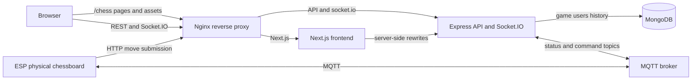
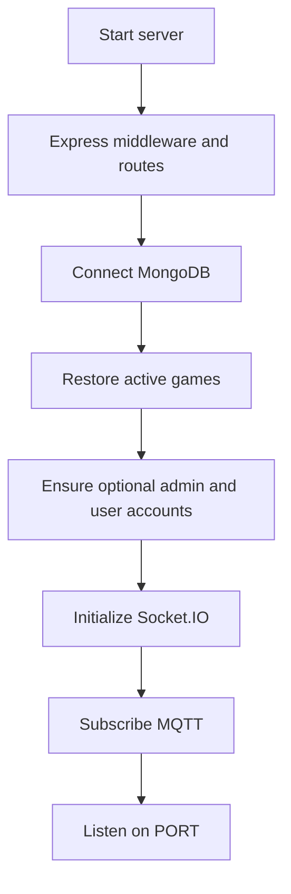
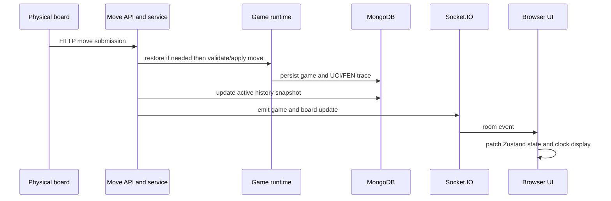

# 01. System Architecture

## Scope and source of truth

TTLab Chess is a real-time system for electronic chessboards. It is not only a browser chess application: physical boards submit status and moves, the backend owns the live game lifecycle, and browsers display the same state through REST and Socket.IO.

This document describes the architecture implemented in the repository as of the current codebase. The source of truth for a live game is the durable MongoDB `games` document plus its restorable runtime chess session. `game_history` is a review snapshot, not the command source for an active physical board.

## Runtime topology



### Deployment variants

- **VPS/Docker:** Nginx is the public entry point. It proxies the frontend below an optional base path such as `/chess`, and proxies API routes and `/socket.io/` to the backend. Docker Compose runs the frontend on container port `3000` published as host port `4000`; the backend listens on `PORT` (default `80`).
- **Hosted frontend:** Next.js rewrites `/auth`, `/games`, `/moves`, `/boards`, and `/eval` to `BACKEND_PROXY_URL`, `API_URL`, or `NEXT_PUBLIC_API_URL`. The browser does not need a direct REST base URL for these calls.
- **Socket.IO:** the browser uses `NEXT_PUBLIC_SOCKET_URL` when configured, otherwise the same browser API origin. It begins with polling and then upgrades to WebSocket when the proxy supports it.

## Core components

| Boundary | Implemented by | Responsibility |
| --- | --- | --- |
| Browser UI | Next.js 16, React 19, Tailwind, Radix UI | Home, board, history, move review, settings, theme, and localization. |
| Client state | Zustand, React hooks, small fetch cache | Holds visible board state, active games, physical boards, clock display, and socket-driven updates. |
| HTTP backend | Node.js, Express 5 | Authenticates requests, applies validation/rate limits, and exposes game, move, board, and history APIs. |
| Realtime backend | Socket.IO | Emits game and board events and scopes game-specific events through rooms. |
| Game runtime | `chess.js` plus `src/js/game` maps | Applies accepted moves, tracks sequences and branches, maps boards to games, and restores sessions after restart. |
| Durable persistence | MongoDB | Stores users, active games, review snapshots, UCI/FEN traces, optional engine analysis, and recycle-bin metadata. |
| Physical-board integration | MQTT service | Subscribes to board status and command topics, starts delayed offline cleanup, and handles equivalent ESP/app restart commands plus resignation and draw commands. |
| Browser engine | Stockfish WebAssembly worker | Optional live evaluation and administrator-requested review analysis; it never decides server game state. |

## Backend structure and startup

`src/js/server.ts` creates one Node HTTP server shared by Express and Socket.IO. Its startup sequence is intentional:

1. Create Express and enable JSON/form parsing, trusted proxy support, and configured CORS.
2. Mount `/moves`, `/games`, `/boards`, and `/auth`; `/` and `/health` are health endpoints.
3. Connect MongoDB.
4. Restore non-finished games from MongoDB into the in-memory repository.
5. Synchronize configured administrator and standard bootstrap accounts when each account's three environment values are present.
6. Initialize Socket.IO on the same HTTP server.
7. Initialize MQTT subscriptions.
8. Listen on `0.0.0.0:PORT`.



The backend folders reflect these boundaries:

```text
src/js/
├── config/       environment database and CORS
├── middleware/   authentication and rate limits
├── routes/       REST route declarations
├── controllers/  HTTP request and response handling
├── services/     move game board MQTT resign and branch policies
├── game/         active chess sessions repository maps and state emitters
├── models/       MongoDB access and history persistence
├── sockets/      Socket.IO setup and event handling
├── types/        backend contracts
└── utils/        chess UCI PGN and shared helpers
```

## State ownership

| State | Owner | Persistence and recovery |
| --- | --- | --- |
| Current game metadata, FEN, PGN, time control, UCI and FEN histories | MongoDB `games` | Recovered at backend startup into a `chess.js` runtime session. |
| Mutable chess instances, board-to-game links, branch data, raw move traces | Backend memory maps | Cache only; rebuilt from active game documents after restart. |
| Board online/offline and initialization status | Backend runtime `gameState` plus MQTT events | Re-established by board heartbeats/status; offline cleanup is delayed to tolerate reconnection. |
| History review snapshot | MongoDB `game_history` | Upserted after accepted moves, finalized when a game ends, and retained while unfinished games are in progress. |
| Browser display state | Zustand and hooks | Rehydrated from REST; Socket.IO applies live patches. |
| Clock display | `use-chess-clock` | Configuration and timestamps come from the active game document; the first accepted move begins the clock. |
| Engine evaluation | Browser Stockfish worker | Ephemeral. Saved per-ply analysis is optional metadata in `game_history`. |

## Main flows

### Physical move to every browser



Board status and lifecycle commands use MQTT topics (`chess/<boardID>/status` and `chess/<boardID>/command`), while physical move payloads are submitted through the move HTTP API. The status topic is reserved for connectivity (`online`/`offline`); restart is handled only by command payloads (`restart_game`/`restart_game_esp`). Command payloads can also resign a side (`{"command":"resign","side":"white"|"black"}`) or agree a draw (`{"command":"draw"}`). Resign/draw uses the same atomic service as the web action, emits the terminal result to the old game room, and publishes the next waiting game so clients can leave the finished game state and retain the physical-board mapping. For NFC/device snapshots, the backend can load a board FEN with validation skipped, keep raw UCI/FEN traces, and build custom notation. This preserves the physical-board record even if the device sequence cannot be replayed as a fully legal `chess.js` game.

### Restart, resign, and recovery

- REST and MQTT restart commands use the same game-action service; they keep the same `gameID` and return the board to the configured start position. The legacy protected Socket.IO `restart` listener emits a room refresh only and is not the persistent command path used by the current web UI.
- Resignation claims an atomic lifecycle transition before final history work, preventing simultaneous clicks or retries from creating duplicate completed games.
- On a Docker or Node restart, `restoreActiveGamesFromDB()` rebuilds non-finished sessions. A board command can also restore the current game lazily by board ID.
- An MQTT offline signal emits an immediate browser notification but waits before destructive cleanup. An online event cancels the pending cleanup.

### History and analysis

Every accepted move updates an active `game_history` snapshot so unfinished games remain reviewable. A finished result finalizes the same durable history record. Administrators can soft-delete history into a 30-day recycle bin and restore it before TTL deletion.

Move Review derives replay and statistics from saved traces. Stockfish analysis uses FEN snapshots first, then UCI plus initial FEN, and finally valid standard PGN. A custom or malformed physical-board move is stored as an unavailable analysis row rather than being invented as an equal engine score or stopping the complete history analysis.

## Security and trust boundaries

- The UI hiding a control is not authorization. Backend mutation endpoints use bearer JWT middleware, and administrator-only actions such as rename, time setup, resign, delete, restore, and analysis are checked server-side. Bootstrap `user` and `admin` accounts are optional environment-driven records; only the admin role passes mutation middleware.
- `JWT_SECRET`, MongoDB connection details, and any MQTT credentials are sensitive environment values and are not committed.
- CORS permits only configured browser origins; ESP and other non-browser clients without an `Origin` header can submit their scoped device requests.
- Rate-limit middleware protects read, mutation, and destructive game routes.
- Nginx is trusted as one proxy hop so the backend receives the forwarded protocol and client address correctly.

## Frontend structure

```text
frontend/
├── app/          App Router pages and route layouts
├── components/   board home played layout providers and shared UI
├── hooks/        game clock socket and Stockfish lifecycles
├── lib/          store API/socket helpers cache and game utilities
├── locales/      matching English and Vietnamese dictionaries
├── public/       images APK QR code and Stockfish assets
└── types/        browser game and socket contracts
```

The frontend keeps user-facing text in `locales/en.ts` and `locales/vi.ts`, rendered through `useT()`. Shared semantic CSS tokens provide matching light and dark themes; pages do not implement separate color systems.

## Related documents

- [02-repository-structure.md](02-repository-structure.md)
- [03-boot-sequence.md](03-boot-sequence.md)
- [05-database.md](05-database.md)
- [06-api-rest.md](06-api-rest.md)
- [07-api-socket.md](07-api-socket.md)
- [10-state-management.md](10-state-management.md)
- [16-deployment.md](16-deployment.md)
- [18-security.md](18-security.md)
- [25-stockfish-evaluation.md](25-stockfish-evaluation.md)
