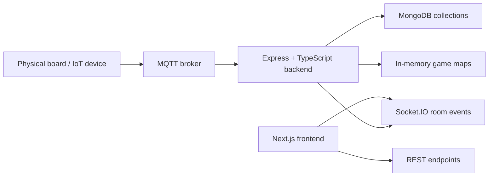

# 01. Architecture

## Purpose

This repository implements a real-time chess management system that combines:

- a Node.js/Express backend for HTTP and WebSocket orchestration,
- a Next.js frontend for interactive board review and game history,
- MongoDB persistence for game snapshots and PGN history,
- MQTT device signaling for physical-board readiness and board lifecycle,
- Docker-based deployment for runtime packaging.

The architectural goal is not a generic web app. It is a control plane for a live chess board workflow where physical hardware, browser clients, and backend game state must stay synchronized.

## Why this architecture exists

The system is designed around a few core constraints:

1. A board scan and a move sequence can arrive from physical hardware, not just from the UI.
2. Game state must be instantly consistent across multiple browser tabs or clients.
3. A chess game is stateful and branch-sensitive, so the server must keep an in-memory chess engine session per active game.
4. The application must survive reconnects and partial board offline events without losing the active game identity.
5. The UI is a replay and review interface, not a full chess engine UI.

That leads to a layered architecture with clear separation:

- HTTP layer for external commands,
- service layer for chess and lifecycle rules,
- in-memory repository for active sessions,
- MongoDB for durable records,
- Socket.IO for live client synchronization,
- MQTT for physical-device status.

## High-level topology

## Layer responsibilities

### Backend runtime

The backend entry point is the Express server created in [src/js/server.ts](../src/js/server.ts). It performs bootstrap, middleware registration, service init, and route mounting.

Responsibilities:

- create the HTTP server,
- wire JSON/body parsers and CORS,
- expose REST routes,
- initialize MongoDB connection,
- initialize Socket.IO,
- initialize MQTT integration.

### Application service layer

The backend service layer owns business rules such as:

- move validation and ambiguity resolution,
- board initialization checks,
- game restart and destroy lifecycle,
- resignation result generation,
- branch creation and branch resolution.

This is where the system is policy-driven rather than transport-driven.

### In-memory runtime state

The backend keeps active chess sessions in memory using maps from [src/js/game/game.repository.ts](../src/js/game/game.repository.ts).

This is necessary because the chess engine operates with mutable state and needs fast access during move resolution and branch navigation.

### Persistence

MongoDB is not the system of record for active move-by-move state in real time. It is the durable store for:

- current game snapshot documents,
- historical ended-game PGN documents,
- metadata used by the frontend history views.

### Frontend runtime

The frontend is a client-side dashboard and review surface. It consumes REST and Socket.IO events to present:

- the active game board,
- branch-aware move tables,
- physical board scan state,
- history and result review.

## Architectural conventions

### Backend conventions

- Files are grouped by responsibility: `routes`, `controllers`, `services`, `models`, `game`, `sockets`, `utils`, `config`.
- Runtime state is kept in maps rather than in a full database query model.
- Common status enums are centralized in [src/js/constant.ts](../src/js/constant.ts).
- TypeScript types are defined in a dedicated `types` area.

### Frontend conventions

- Next.js App Router pages are located in `frontend/app`.
- Shared UI is placed in `frontend/components/ui`.
- Hooks encapsulate data fetching and socket listener behavior.
- Zustand is the single client-side state container.
- All user-facing text is localized through `useT()` and paired English/Vietnamese dictionaries; frontend components must not hard-code visible strings.

## Cross references

- [02-repository-structure.md](02-repository-structure.md) explains the folder layout.
- [03-boot-sequence.md](03-boot-sequence.md) explains startup ordering.
- [06-api-rest.md](06-api-rest.md) covers HTTP contracts.
- [07-api-socket.md](07-api-socket.md) covers live event contracts.
- [10-state-management.md](10-state-management.md) explains runtime memory and client store design.
