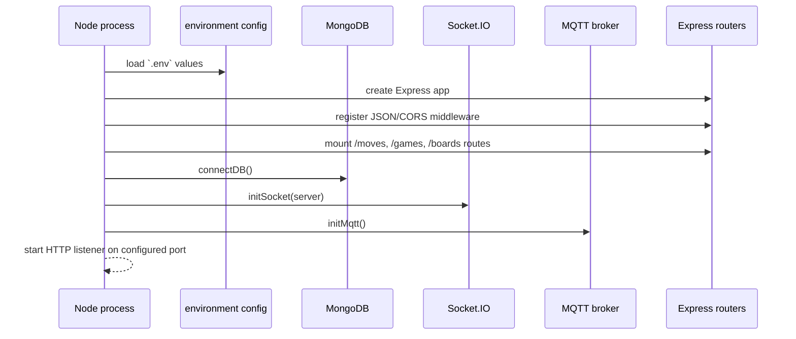

# 03. Boot Sequence

## Boot objective

The application boot order is intentionally explicit so that the backend can be ready for HTTP, WebSocket, and MQTT traffic before clients begin interacting with it.

## Startup sequence

## Why the order matters

1. Environment variables must be loaded before any service wants to connect to infrastructure.
2. The HTTP server should be created before Socket.IO so sockets can attach to the same server instance.
3. Database connection is performed before any persistence-dependent request path can be used.
4. MQTT initialization happens during backend bootstrap so physical board status events can be captured immediately.

## Main boot responsibilities by file

### [src/js/server.ts](../src/js/server.ts)

This file is the server entry point. It:

- creates the `http.Server` instance,
- applies middleware,
- mounts routers,
- awaits the MongoDB connection,
- initializes socket and MQTT modules,
- begins listening on the configured port.

### [src/js/config/environment.ts](../src/js/config/environment.ts)

Loads the runtime configuration and enforces required infrastructure values such as MongoDB and MQTT endpoints.

### [src/js/config/database.ts](../src/js/config/database.ts)

Creates the MongoDB client and connects to the `chess` database after a ping check.

### [src/js/sockets/index.ts](../src/js/sockets/index.ts)

Creates the singleton `io` server and registers the game socket lifecycle.

### [src/js/services/mqtt.service.ts](../src/js/services/mqtt.service.ts)

Connects to the MQTT broker and subscribes to board status topics.

## Runtime startup assumptions

The application expects the following to exist before the backend can function normally:

- valid `MONGO_URI` or fallback configuration,
- valid `URL_HIVEMQTT` credentials,
- a reachable MongoDB endpoint,
- a running broker for the configured topic.

If any of these are missing or unreachable, the app may start partially but real-time chess state cannot function reliably.

## Cross references

- [04-environment.md](04-environment.md) explains the required runtime variables.
- [05-database.md](05-database.md) explains the persistence layer after connection.
- [07-api-socket.md](07-api-socket.md) explains what the socket layer becomes available for after boot.
