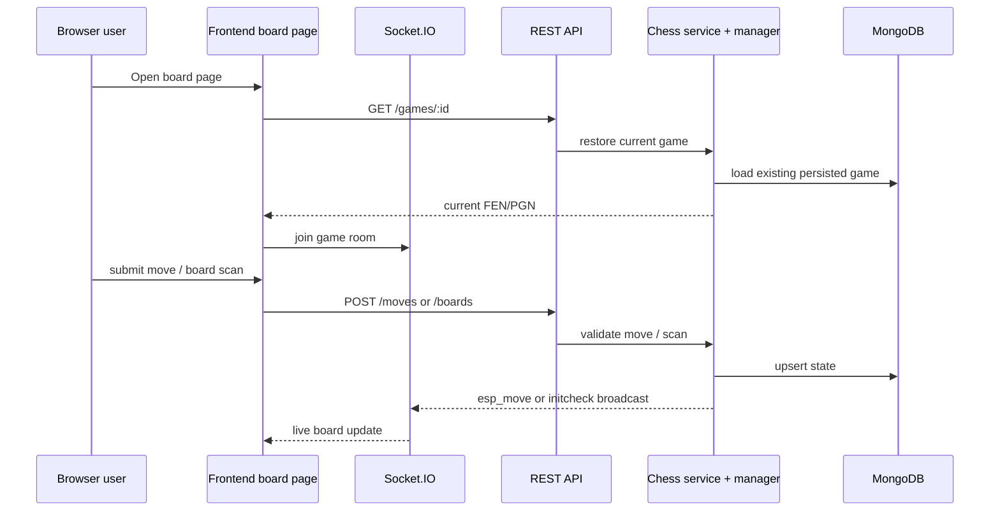

# 14. Business Flow

## Overview

This repository implements a real-time chess session workflow that spans board hardware, backend state, and browser-side review. The flow is not an arbitrary CRUD sequence; it is a stateful game lifecycle designed around board scan readiness and move confirmation.

## Canonical flow

## Lifecycle stages

### 1. Board scan and board creation

A board pair is created via the `/boards` endpoints. The backend verifies the scanning result and then aligns it with a new `gameID`.

The scan result feeds the `initcheck` state so the UI can show missing or wrong pieces before a game becomes active.

### 2. Game hydration

When the board page loads, it uses the `gameID` route parameter to load the game via the REST API. If the game is not found in the current client cache, it fetches from the network and loads the FEN or PGN into a local `Chess` engine instance.

### 3. Initialize room membership

The board page joins a `gameID` Socket.IO room so it can receive both the authoritative `esp_move` event and room-level game lifecycle broadcasts.

### 4. Move execution

A move submission flows through the move service, which:

- validates the move candidates,
- resolves legal move paths,
- updates the in-memory chess engine,
- writes the projected state to persistence,
- broadcasts the new FEN/PGN to game-room clients.

### 5. Result or restart handling

When a game is ended, restarted, or resigned, the backend updates the board state and emits `update_all_game` and `game_restart` to notify clients to refresh their view.

## Board-type processing behavior

The system supports two board semantics:

- NFC board layout via square-to-piece mapping
- HALL board layout via binary 2D matrix checks

Both feeding paths eventually converge in the same game lifecycle abstraction.

## Recovery and reconnect behavior

The system intentionally supports reconnect recovery:

- if the browser reconnects, it can request the current game state again
- if a board scan state is missing, the endpoint can report `WAITING` rather than failing hard
- the client uses cached board state and socket event recovery to avoid a blank board view

## Cross references

- [06-api-rest.md](06-api-rest.md) documents the request endpoints used in the flow.
- [07-api-socket.md](07-api-socket.md) documents the event shape used in the live component.
- [15-navigation.md](15-navigation.md) explains how the user navigates through these stages in the UI.
