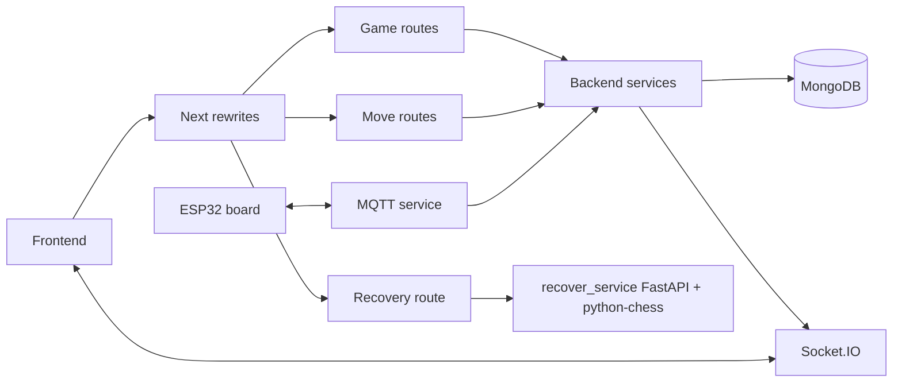

# 26. Repository CodeGraph

CodeGraph is a local developer/AI index. It stores nodes (files, symbols,
routes and services) and edges (imports, calls and references) in
`.codegraph/codegraph.db`. It does not run in production and is excluded from
Git and Docker images.

## Application flow



This is a readable architecture view; the SQLite database is the underlying
machine-readable graph used by MCP queries.

## Commands

```powershell
codegraph status
codegraph sync
```

The watcher normally syncs after a file save. Run `sync` after `git pull` or
when `status` reports stale files. Useful questions include:

- Analyze the flow from `POST /games/recover` to `recover_service`.
- Show callers and impact radius for `GameActionController.restart`.
- List modules that depend on `game.resign.service`.

Initialize a new checkout with:

```powershell
codegraph init
```
