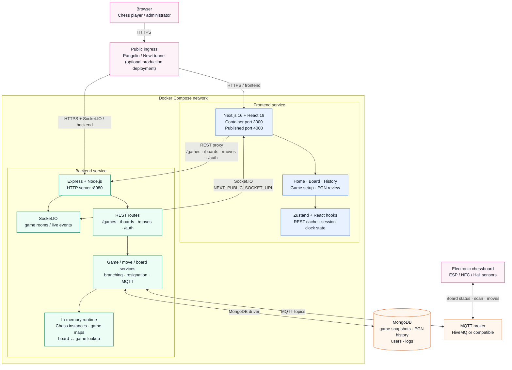
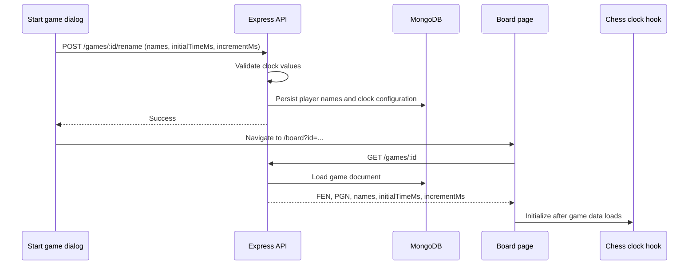
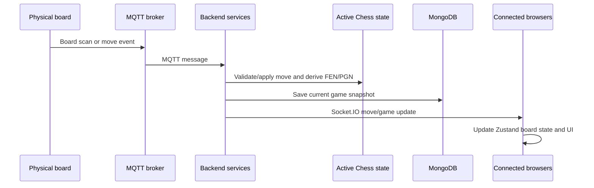

# System Architecture and Design

## Purpose

TTLab Chess Web is a real-time chess control system for browser clients and physical chessboards. It combines a Next.js user interface, an Express/Socket.IO backend, MongoDB persistence, and MQTT device communication.

The design separates durable game data from the in-memory chess engine state needed to validate and broadcast live moves quickly.

## System design

### System Architecture Diagram



**Legend:** blue = frontend, green = backend runtime, orange = data/messaging infrastructure, pink = external client or device boundary.

### Components and responsibilities

| Component | Technology | Responsibility |
| --- | --- | --- |
| Frontend | Next.js 16, React 19, TypeScript, Zustand | Renders game setup, chessboard, clocks, move history, PGN review, and board-status UI. |
| Backend API | Node.js, Express, TypeScript | Accepts game, board, move, and authentication requests; coordinates lifecycle rules. |
| Realtime layer | Socket.IO | Sends move, game-state, restart, rename, and board lifecycle updates to connected clients. |
| Chess runtime | `chess.js` + in-memory maps | Holds active chess sessions, validates moves, resolves branches, and maps physical boards to games. |
| Persistence | MongoDB | Stores game snapshots, player names, FEN, PGN, clock configuration, history, and application records. |
| Device integration | MQTT | Receives physical-board connectivity, scan, and move signals and publishes required device messages. |
| Deployment | Docker Compose, optional Newt/Pangolin | Runs frontend and backend containers and exposes public endpoints when configured. |

## Backend design

The backend entry point is [src/js/server.ts](../src/js/server.ts). It creates one HTTP server shared by Express and Socket.IO, connects MongoDB, initializes MQTT, and mounts the following route groups:

- `/boards` — physical-board registration and initial-position checks.
- `/games` — game retrieval, lifecycle actions, player setup, clock configuration, PGN, and history.
- `/moves` — move submission and chess-state updates.
- `/auth` — authentication endpoints.

Backend modules are organized by responsibility:

```text
src/js/
├── config/       # Environment parsing and MongoDB connection
├── controllers/  # HTTP request/response handling
├── game/         # Active Chess instances and runtime maps
├── models/       # MongoDB collection access
├── routes/       # Express route definitions
├── services/     # Game, move, board, MQTT, resign, and branch rules
├── sockets/      # Socket.IO initialization and event handlers
├── types/        # API and domain TypeScript contracts
└── utils/        # Chess and data-processing helpers
```

### State boundaries

| State | Location | Reason |
| --- | --- | --- |
| Active `Chess` instances, move sequences, branches, board-to-game links | `src/js/game/` in memory | Fast stateful move validation and live device handling. |
| Current game documents and PGN history | MongoDB collections | Survives process restart and supports direct board URLs/reloads. |
| Browser board state | Zustand store in `frontend/lib/store.ts` | Keeps each visible board responsive while REST and Socket.IO updates arrive. |
| Clock configuration | MongoDB game document: `initialTimeMs`, `incrementMs` | Ensures a selected clock duration is available after a browser reload. |
| Per-tab live clock offsets | `sessionStorage` through `use-chess-clock.ts` | Preserves elapsed local clock state during a browser reload. |

## Frontend design

The frontend lives in `frontend/` and uses the Next.js App Router. Key areas are:

- `app/` — page routes such as home, board, played history, review, login, and PGN paste.
- `components/board/` — board rendering, clock cards, actions, evaluation, PGN table, and multi-board slots.
- `components/home/` — physical-board and game selection/start dialogs.
- `hooks/use-game.ts` — REST loading, Socket.IO synchronization, FEN/PGN state, and board state updates.
- `hooks/use-chess-clock.ts` — display and local ticking of the persisted game clock configuration.
- `lib/socket.ts` and `components/providers/socket-provider.tsx` — browser Socket.IO connection lifecycle.

The frontend reaches the backend through Next.js rewrites for REST requests (`API_URL`) and a browser-visible Socket.IO endpoint (`NEXT_PUBLIC_SOCKET_URL`).

## Main data flows

### Game creation and clock setup



`initialTimeMs` and `incrementMs` are the canonical internal time units. Older game documents that only contain second-based clock fields are converted once when the frontend loads the game; missing legacy data uses the documented 10-minute compatibility fallback.

### Physical move and realtime update



## Reliability considerations

- Browser reload/direct board access loads game and clock configuration from MongoDB rather than navigation-only state.
- Socket.IO clients join rooms by `gameID` to limit game-specific updates.
- MongoDB snapshots allow active game recovery after the in-memory session is missing.
- The backend validates configured clock durations before saving them.
- Player-name and clock-configuration changes are protected by an administrator JWT on both the UI and backend API boundary.
- The visible chess clock remains paused until the first accepted move, preventing pre-game setup time from being consumed.
- The deployment uses environment variables for MongoDB, MQTT, API, socket, and public-host configuration; secrets must remain outside source control.

## Related documentation

- [01-architecture.md](01-architecture.md) — architectural rationale and layers.
- [03-boot-sequence.md](03-boot-sequence.md) — startup order.
- [06-api-rest.md](06-api-rest.md) — REST contract reference.
- [07-api-socket.md](07-api-socket.md) — Socket.IO events.
- [10-state-management.md](10-state-management.md) — state ownership details.
- [16-deployment.md](16-deployment.md) — deployment guidance.
